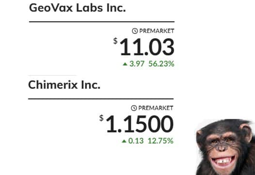
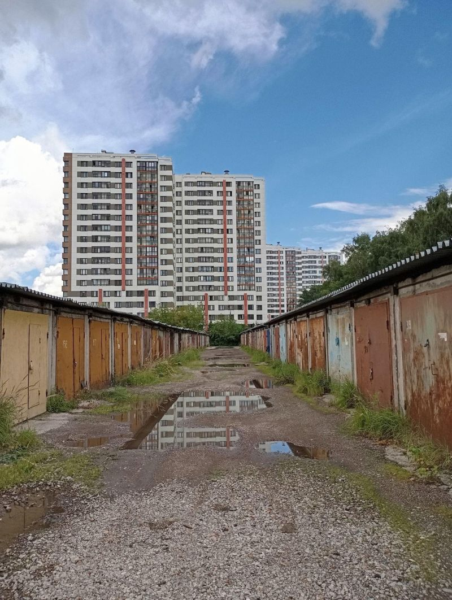
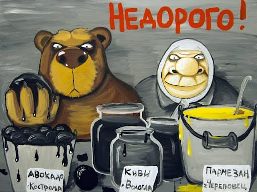
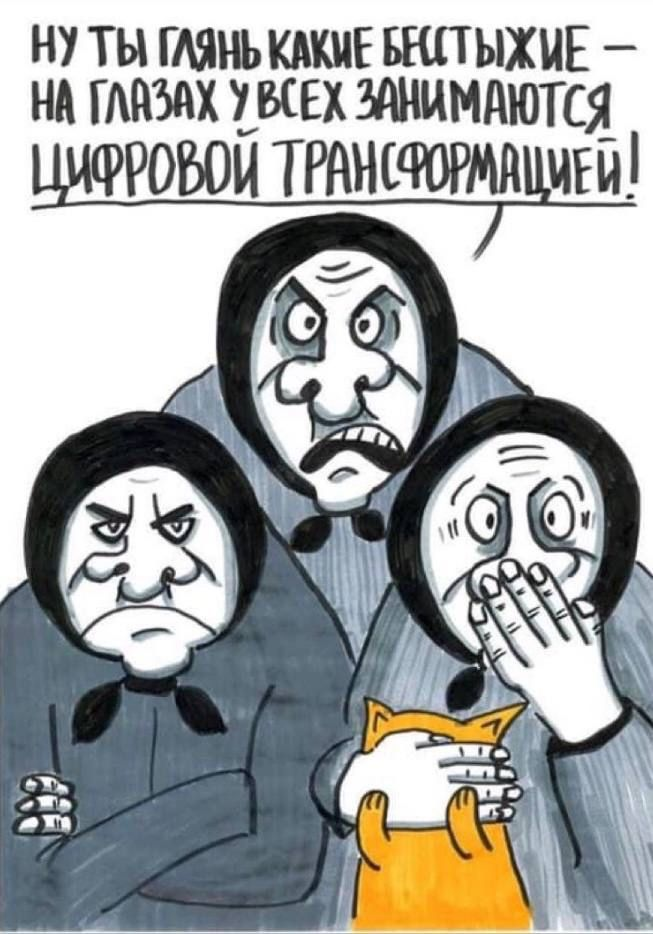
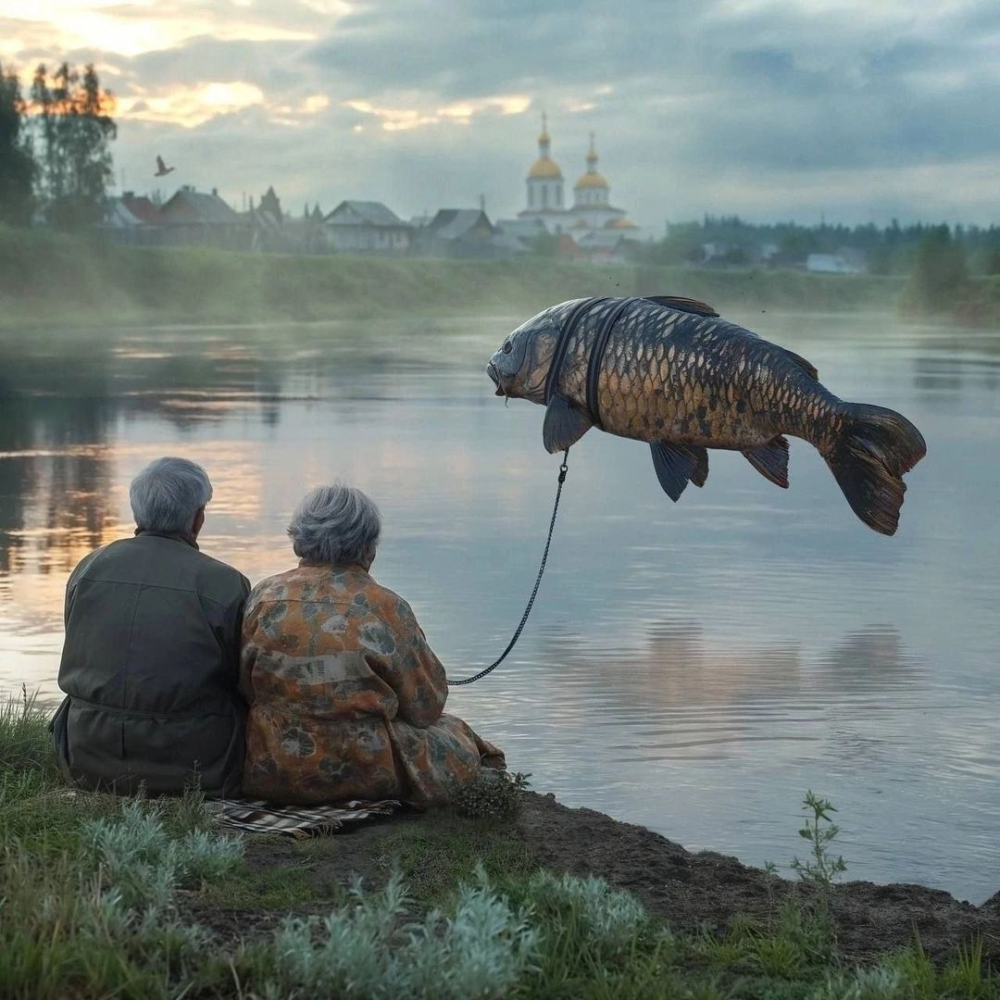
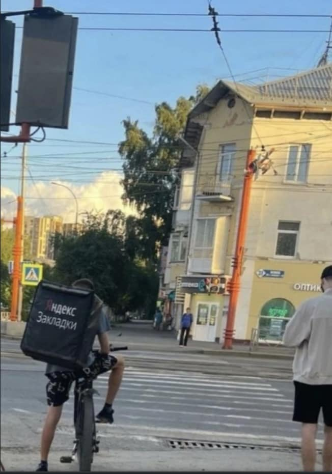
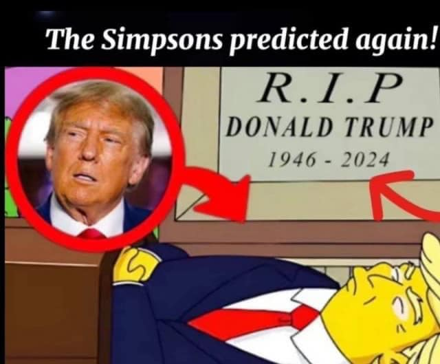

# Хроники LinkedIn

Хроники LinkedIn - серия постов. Посты задумывались как юмористические, и в то же время - жгучие, злободневные и грустные. Уж какие есть. Для посмеяться и подумать.

----
### 20.08.2024

Открыл LinkedIn.

- "Рекрутеры исчезают, как будто растворяются в воздухе"
- "680 человек в онлайне на вебинаре"
- "Переродиться на Кубе: как островной интернет живет благодаря кустарным методам и обходу запретов"
- "России не грозит распространение оспы обезьян благодаря традиционным ценностям, заявила глава Роспотребнадзора Анна Попова"
- "Яндекс.Маркет вводит сервисный сбор для пользователей, он будет фиксированным и составит 20 рублей за заказ"…

Закрыл LinkedIn.

----
### 19.08.2024

Открыл LinkedIn.

- "Нынешнее поколение должно планировать карьеру до 68-75 лет"
- "Если вас "завернули" на интервью, вы просто не понравились интервьюеру"
- "В российских ИТ-компаниях взрывной спрос на программистов со знанием китайского языка"
- "Миллиардеру Усманову разрешат собирать с россиян деньги за маркировку салатов и кондитерских изделий"
- "Баба Яга была еврейкой"...

Закрыл LinkedIn.

----
### 16.08.2024

Открыл LinkedIn.  
  
- "Подсобный рабочий, зарплата 297 000 рублей на руки"  
- "Был в Люберцах, накупил DVD"  
- "MVP vs Говно"  
- "Россиянку расчленили в практикующем аяуаску центре в Перу"  
- "В Туркменистане перестали продавать сим-карты"…  
  
Закрыл LinkedIn.

----
### 15.08.2024

Открыл LinkedIn.  
  
- "Почему вас уволят, если вы используете Chat GPT"  
- "До конца 2025 года Сбербанк нацелен занять до четверти рынка в Крыму, оценил Герман Греф"  
- "Российским блогерам с аудиторией более десяти тысяч подписчиков предоставили обязательный список источников, на которые им разрешено ссылаться"  
- "На вице-мэра Воркуты составили протокол за употребление мефедрона"  
- "Зачем Паша Дуров стал донором спермы?"..

Закрыл LinkedIn.

----
### 14.08.2024

Открыл LinkedIn.

- "Считаете ли вы, что резюме себя изжило и нужно создавать другие инструменты отбора?"
- "На фоне замедления YouTube Яндекс начал предлагать альтернативные источники"
- "У лидера одной российской компании в области кибербезопасности биполярное аффективное расстройство"
- "Как быть, если у парня и девушки разное либидо?"
- "Отключение AdSense в России не принесет тектонических изменений в блогосферу"…

Закрыл LinkedIn.

----
### 13.08.2024

Открыл LinkedIn.   

- "Что происходит на рынке, когда рабочие места есть, но их как-бы нет?"  
- "Оплата после взлета проекта"  
- "Google отключил монетизацию контента для российских пользователей"  
- "Российский ответ Jira и Confluence: открыт бесплатный демодоступ к системе управления проектами Яга"  
- "Х..й вам всем, а не сеньоров"…  

Закрыл LinkedIn.

----
### 11.08.2024

Открыл LinkedIn.  

- "В Госдуме попросили Генпрокуратуру проверить дизайнера Лебедева после интервью журналисиу-иноагенту Дудю"  
- "Роскомнадзор начал розыск установленных у провайдеров кэширующих серверов Google"  
- "Для россиян назвали топ-5 умных телевизоров"  
- "Я понял кто я и зачем я здесь"  
- "Умерла бывшая глава YouTube Сюзан Войжицки"...  

Закрыл LinkedIn.

----
### 10.08.2024

Открыл LinkedIn.  

- "В России заблокировали мессенджер Signal"  
- "ВК займется импортозамещением WhatsApp"  
- "Объем сделок с жильем в РФ упал на 40%"  
- "Много ли людей сейчас даунгрейдится за рубеж?"  
- "Роскосмос запланировал отправлять на МКС космических туристов"...  

Закрыл LinkedIn.

----
### 09.08.2024

Открыл LinkedIn.  

- "Артемий Лебедев извинился перед Екатериной Мизулиной за свои слова о ней в интервью Дудю"  
- "Ростелеком создает коммерческий ИТ-кластер, который объединит разработки дочерних ИТ-компаний"  
- "В марте 2024 нехватка курьеров по всей России составляла 140 тысяч человек, а к концу этого года может вырасти до 300 тысяч"  
- "Чем на большее количество собеседований вы ходите, тем веселее"  
- "В Башкортостане захотели закупить патроны в рамках проекта по увеличению продолжительности жизни"…  

Закрыл LinkedIn.

----

### 07.08.2024

Открыл LinkedIn.  

- "Из 877 протестированных кандидатов 22 прошли тест и 4 были признаны достойными"  
- "Венесуэльский диктатор Мадуро призвал прекратить использовать WhatsApp и перейти на Telegram"  
- "Самый востребованный язык программирования в России - 1С"  
- "Дождевые черви смогут прокормить человечество в случае ядерной войны"  
- "Как разрабатывать без YouTube?"…  

Закрыл LinkedIn.

----

### 06.08.2024

Открыл LinkedIn.  

- "Илон Маск анонсировал свою первую подругу-робота с искусственным интеллектом, назвав ее умной, красивой и послушной"  
- "Проезд в плацкарте в первой половине 2024 года подорожал на 23%"  
- "РекрУтер или рекрутЁр?"  
- "Чистый убыток Ozon за второй квартал составил 13.1 млрд рублей"  
- "Северная Корея - идеальное место, чтобы на время отключиться от мира"…  

Закрыл LinkedIn.

----

### 03.08.2024

Открыл LinkedIn.

- "Артемий Лебедев три часа проходил собеседование на вакансию дизайнера к Дудю. И не прошёл"
- "Производство одеколонов в России достигло рекорда
- "Как у вас с оральными навыками?"
- "Сбербанк повысит стоимость уведомлений по дебетовым картам"
- "А в рунете только и разговоров что о торможении YouTube"...

Закрыл LinkedIn.

----

### 02.08.2024

Открыл LinkedIn.

- "Странная нестыковочка, или Россия как черная финансовая зона"
- "На фоне новостей о семени Павла Дурова бум случился в клиниках ЭКО"
- "Курьерам в России хотят запретить платить более 100 тысяч рублей в месяц"
- "Минимальный срок работы в ИТ-компании - в течение всего срока ипотеки"
- "В Кыргызстане запретили вебкам"...

Закрыл LinkedIn.

----
### 01.08.2024

Открыл LinkedIn.

- "Если человек прошел 7 этапов собеседований и понравился всем, но завалил собеседование с СЕО, стоит ли ему давать еще шанс?"
- "Китайский Zeekr решил блокировать свои автомобили в России"
- "Сегодня я уволил программиста. Он поступил плохо: подрабатывал еще в другом месте"
- "После массовой депортации мигрантов с полок российских магазинов начали пропадать продукты питания"
- "Вы недостаточно сеньорны для онбординга"...

Закрыл LinkedIn.

----

### 31.07.2024

Открыл LinkedIn.

- "Когда российские компании достигают определенных границ роста, у них появляется потребность в фигурах поддержки"
- "Артемий Лебедев рассказал, что "ни за что на свете" не будет встречаться с ровесницами"
- "Госдума приняла поправку, обязывающую блогеров с 10 тысячами подписчиков раскрывать свою личность Роскомнадзору"
- "Павел Дуров заявил, что у него более 100 биологических детей в 12 странах"
- "Обратный карго-культ"...

Закрыл LinkedIn.

----

### 30.07.2024

Открыл LinkedIn.

- "CrowdStrike отправила сотрудникам по $10 из-за переработок во время сбоя"
- "Что делать с сотрудником, ходящим налево по собеседованиям?"
- "Хочешь на пробежку? Иди на пробежку, не ищи себе компанию!"
- "Неправильно поздоровался - резюме в корзину!"
- "Московский метрополитен закупил 12 бронетранспортеров"…

Закрыл LinkedIn.

----

### 25.07.2024

Открыл LinkedIn.

- В Роспатенте зарегистрировали товарный знак игры Hamster Kombat
- Совладелец Wildberries обратился за защитой к Рамзану Кадырову
- Яндекс решил открывать продуктовые минимаркеты
- Илон Маск назвал кандидатку в президенты США Камалу Харис некомпетентной
- Беспилотные такси устроили хаос и пробки на дорогах в Ухане...

Закрыл LinkedIn.

----

### 21.07.2024

Открыл LinkedIn.

- “Для устранения проблемы CrowdStrike нужно выключить и включить систему до 15 раз, - Microsoft”
- "Автомобили Tesla смогут проводить диагностику и самостоятельно заказывать себе запчасти"
- "Нормально ли звонить соискателю после 18:00?"
- "Глобальный сбой Windows, не коснулся Казахстана, потому что на объектах критической инфраструктуры мы используем пиратское программное обеспечение," — заявил министр цифрового развития Жаслан Мадиев"
- "В России пройдет чемпионат по огуречному хрусту"...

Закрыл LinkedIn.

----

### 19.07.2024

Открыл LinkedIn.

- "Несколько российских девелоперов потеряли доступ к проектной документации из-за блокировки аккаунтов Autodesk"
- "Уволить аккуратного, но не умного, или талантливого, но неаккуратного?"
- "Как не зависеть от денег?"
- "Предоставить гражданство Казахстана Павлу Дурову"
- "Илон Маск поддержал Дональда Трампа на выборах через несколько минут после стрельбы в Пенсильвании"...

Закрыл LinkedIn.

----

### 18.07.2024

Открыл LinkedIn.

- "Оклад выплачивать по трудовому договору, а премию на специально открытое для этого ИП"
- "Илон Маск обвинил Еврокомиссию в том, что та предлагала социальной сети X незаконную секретную сделку"
- "Деньги уже не мотивируют сотрудников"
- "Владельцы Cybertruck жалуются, что по ночам в их машины пытаются залезть еноты - потому, что путают их с мусорными контейнерами"
- "79% россиян допускают существование инопланетян, следует из опроса Rambler&Co"...

Закрыл LinkedIn.

----

Открыл LinkedIn.  

- "Спрос на вибраторы на российских маркетплэйсах в июне вырос почти втрое".  
- "РПЦ признала грехом использование VPN-сервисов".  
- "Буллинг из-за внешнего вида в компании".  
- "Все зависит от настроения руководителя".  
- "Директор по продукту, он же верховный сэйлз"... 

Закрыл LinkedIn.

----

Открыл LinkedIn.  
  
- "В России вырос спрос на шеринг айтишников"
- "Российский SWIFT попал под санкции ЕС"
- "Неоплачиваемая стажировка 6 месяцев" 
- "Корпоративный браслет"
- "Юра, прости нас…"

Закрыл LinkedIn.

----

